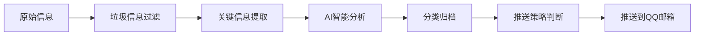

# 🎓 合工大信息监控系统 (HFUT Info Monitor)

<p align="center">
  
  
  
  
</p>

<p align="center">
  <strong>🤖 AI驱动的合工大信息监控与推送系统</strong><br>
  自动监控合工大官网、微信公众号、QQ空间等渠道，AI智能过滤与推送
</p>

---

## 📖 目录

- [项目简介](#项目简介)
- [功能特性](#功能特性)
- [系统架构](#系统架构)
- [快速开始](#快速开始)
- [详细配置](#详细配置)
- [使用指南](#使用指南)
- [项目结构](#项目结构)
- [路线图](#路线图)
- [贡献指南](#贡献指南)
- [许可证](#许可证)
- [联系方式](#联系方式)

---

## 📝 项目简介

**合工大信息监控系统** 是一个基于AI的智能化信息监控与推送平台，专为合肥工业大学师生设计。

### 🎯 核心价值

- **全自动监控**：7×24小时监控合工大官方信息渠道
- **AI智能过滤**：基于Ollama本地LLM，自动过滤垃圾信息
- **精准推送**：根据信息重要性分级推送，不错过任何关键通知
- **多源整合**：整合官网、微信公众号、QQ空间、QQ群等多渠道信息

### 💡 应用场景

- ✅ 及时获取教务处通知
- ✅ 监控奖学金、竞赛等信息
- ✅ 跟踪学术讲座和活动
- ✅ 过滤无关信息，提高信息获取效率

---

## ✨ 功能特性

### 1️⃣ 信息监控

| 监控源 | 状态 | 说明 |
|--------|------|------|
| 微信公众号 | ✅ 已支持 | 合肥工业大学、合工大宣城校区、教务处等 |
| QQ空间动态 | ✅ 已支持 | 监控9个指定QQ号 |
| QQ群聊 | 🔄 开发中 | 支持关键词过滤和@提醒 |
| 官网爬虫 | 🔄 开发中 | 自动爬取官网公告 |

### 2️⃣ AI私人秘书



**核心能力**：

- ✅ **智能过滤**：基于关键词+正则表达式+AI语义分析
- ✅ **信息提取**：自动提取标题、时间、来源、重要内容
- ✅ **智能分类**：自动分类为学习、通知、活动、学术等类别
- ✅ **每日摘要**：每晚20:00生成当日信息摘要
- ✅ **紧急推送**：紧急信息立即推送到QQ邮箱

### 3️⃣ 推送方式

| 推送方式 | 状态 | 说明 |
|----------|------|------|
| QQ邮箱 | ✅ 已支持 | 默认推送方式 |
| 企业微信 | 🔄 可选 | 需要企业微信API |
| QQ消息 | 🔄 可选 | 需要go-cqhttp支持 |
| Telegram | 📋 计划中 | 通过Bot API推送 |

---

## 🏗️ 系统架构

```
合工大信息监控系统 v3.1
│
├── 📥 数据采集层
│   ├── 微信公众号爬虫 (WechatSogou)
│   ├── QQ空间监控 (go-cqhttp / NapCat)
│   ├── QQ群聊监控 (go-cqhttp / NapCat)
│   └── 官网爬虫 (Selenium + BeautifulSoup)
│
├── 🔧 数据处理层
│   ├── 垃圾信息过滤 (关键词 + 正则 + AI)
│   ├── 关键信息提取 (NLP + 正则)
│   ├── AI智能分析 (Ollama本地LLM)
│   └── 分类归档 (机器学习分类器)
│
├── 💾 数据存储层
│   ├── SQLite数据库 (结构化存储)
│   ├── JSON归档文件 (原始数据备份)
│   └── IMA知识库 (可选，语义检索)
│
└── 📤 推送层
    ├── QQ邮箱推送 (SMTP)
    ├── 企业微信推送 (API)
    └── QQ消息推送 (go-cqhttp HTTP API)
```

---

## 🚀 快速开始

### 环境要求

- **Python**: 3.8+ 
- **Node.js**: 16+ (可选，用于NapCat)
- **Ollama**: 最新版 (可选，用于AI分析)
- **操作系统**: Windows 10/11, Linux, macOS

### 安装步骤

#### 1. 克隆项目

```bash
git clone https://github.com/janet-lee/hfut_info_monitor.git
cd hfut_info_monitor
```

#### 2. 安装Python依赖

```bash
pip install -r requirements.txt
```

**主要依赖**：

- `requests` - HTTP请求
- `beautifulsoup4` - HTML解析
- `selenium` - 浏览器自动化
- `sqlalchemy` - 数据库ORM
- `schedule` - 定时任务
- `ollama` - 本地LLM接口

#### 3. 安装go-cqhttp (可选，用于QQ监控)

```bash
# 下载go-cqhttp
wget https://github.com/Mrs4s/go-cqhttp/releases/download/v1.2.0/go-cqhttp_windows_amd64.exe

# 重命名
mv go-cqhttp_windows_amd64.exe go-cqhttp.exe

# 运行并配置
./go-cqhttp.exe
```

#### 4. 安装NapCat (推荐，QQ机器人框架)

```bash
cd NapCat
# 按照NapCat官方文档配置
```

#### 5. 配置Ollama (可选，用于AI分析)

```bash
# 安装Ollama
# Windows: 从 https://ollama.ai 下载安装

# 拉取模型
ollama pull qwen2:7b

# 启动Ollama服务
ollama serve
```

---

## ⚙️ 详细配置

### 配置文件结构

配置文件位于 `config/config.json`：

```json
{
  "monitor": {
    "wechat_accounts": [
      "合肥工业大学",
      "合肥工业大学宣城校区",
      "合肥工业大学教务处"
    ],
    "qq_numbers": [
      "123456789",
      "987654321"
    ],
    "qq_groups": [
      "群号1",
      "群号2"
    ]
  },
  "ai": {
    "enabled": true,
    "model": "qwen2:7b",
    "ollama_url": "http://localhost:11434"
  },
  "push": {
    "email": {
      "enabled": true,
      "smtp_server": "smtp.qq.com",
      "smtp_port": 465,
      "sender": "your_qq@qq.com",
      "password": "your_auth_code",
      "receivers": [
        "receiver_qq@qq.com"
      ]
    },
    "wechat_work": {
      "enabled": false,
      "corpid": "",
      "corpsecret": "",
      "agentid": ""
    }
  },
  "filter": {
    "keywords_blacklist": [
      "广告",
      "推广"
    ],
    "keywords_whitelist": [
      "通知",
      "奖学金",
      "竞赛"
    ]
  }
}
```

### QQ邮箱授权码获取

1. 登录QQ邮箱网页版
2. 点击 **设置** → **账户**
3. 找到 **POP3/IMAP/SMTP/Exchange/CardDAV/CalDAV服务**
4. 开启 **IMAP/SMTP服务**
5. 生成 **授权码**（不是QQ密码！）
6. 将授权码填入 `config/config.json` 的 `push.email.password` 字段

### go-cqhttp配置

1. 运行 `go-cqhttp.exe`
2. 首次运行会生成 `config.yml`
3. 编辑 `config.yml`，填写QQ号和密码（或扫码登录）
4. 重新运行 `go-cqhttp.exe`

---

## 📖 使用指南

### 启动系统

#### 方式一：启动所有模块

```bash
python scripts/main.py
```

#### 方式二：分别启动各模块

```bash
# 微信公众号监控
python scripts/wechat_monitor.py

# QQ空间监控
python scripts/qzone_monitor.py

# AI私人秘书
python scripts/ai_secretary.py

# 推送服务
python scripts/push.py
```

### 定时任务配置

#### Windows任务计划程序

1. 打开 **任务计划程序**
2. 创建基本任务
3. 触发器：**每天 08:00**
4. 操作：**启动程序**
5. 程序：`python.exe`
6. 参数：`D:\hfut_info_monitor\scripts\main.py`

#### 使用APScheduler (跨平台)

```python
# scripts/scheduler.py
from apscheduler.schedulers.blocking import BlockingScheduler
from scripts.main import main
from scripts.ai_secretary import generate_digest

scheduler = BlockingScheduler()

# 每天早上8点运行监控
scheduler.add_job(main, 'cron', hour=8)

# 每天晚上8点生成摘要
scheduler.add_job(generate_digest, 'cron', hour=20)

scheduler.start()
```

运行调度器：

```bash
python scripts/scheduler.py
```

### 推送策略

| 信息类型 | 推送方式 | 推送时间 | 示例 |
|----------|----------|----------|------|
| 🔴 紧急通知 | 即时推送 | 立即 | 停课通知、紧急会议 |
| 🟠 重要通知 | 即时推送 | 立即 | 奖学金申请、竞赛报名 |
| 🟡 普通通知 | 每日摘要 | 20:00 | 讲座通知、活动预告 |
| 🟢 活动信息 | 每日摘要 | 20:00 | 社团活动、学术沙龙 |
| 🔵 学术信息 | 每日摘要 | 20:00 | 论文发表、学术会议 |

---

## 📂 项目结构

```
D:\项目整理\01-代码项目\hfut_info_monitor\
│
├── 📁 config/                    # 配置文件
│   └── config.json               # 主配置文件
│
├── 📁 scripts/                   # Python脚本
│   ├── main.py                   # 主控制脚本
│   ├── wechat_monitor.py         # 微信公众号监控
│   ├── qzone_monitor.py         # QQ空间监控
│   ├── group_monitor.py          # QQ群聊监控
│   ├── ai_secretary.py           # AI私人秘书
│   ├── filter.py                 # 垃圾信息过滤
│   ├── push.py                   # 推送功能
│   └── scheduler.py              # 定时任务调度器
│
├── 📁 BuddySecretary/            # BuddyOS AI伙伴系统
│   └── ...                       # AI对话和分析模块
│
├── 📁 NapCat/                    # NapCat QQ机器人
│   └── ...                       # QQ机器人框架
│
├── 📁 go-cqhttp/                 # go-cqhttp框架
│   └── ...                       # 旧版QQ机器人框架
│
├── 📁 data/                      # 数据文件
│   ├── hfut_archive.db          # SQLite数据库
│   └── hfut_archive.json        # JSON归档文件
│
├── 📁 logs/                      # 日志文件
│   └── monitor.log               # 系统日志
│
├── 📄 requirements.txt           # Python依赖列表
├── 📄 README.md                 # 本文件
└── 📄 .gitignore                # Git忽略文件
```

---

## 🗺️ 路线图

### ✅ 第一阶段（已完成）

- [x] 创建工作空间
- [x] 创建配置文件
- [x] 实施微信公众号监控
- [x] 实施QQ空间监控
- [x] 配置QQ邮箱推送

### 🔄 第二阶段（进行中）

- [ ] 实施AI私人秘书功能
- [ ] 优化垃圾信息过滤算法
- [ ] 生成每日摘要
- [ ] 添加QQ群聊监控

### 📋 第三阶段（计划中）

- [ ] 部署到Y7000P (RTX 4060)
- [ ] 7×24小时运行
- [ ] 添加更多监控源（官网、微博等）
- [ ] 开发Web管理界面
- [ ] 支持Telegram推送

### 💡 未来展望

- 集成更多高校信息源
- 开发移动端App
- 支持多用户定制
- 添加数据可视化分析

---

## 🤝 贡献指南

我们欢迎任何形式的贡献！

### 如何贡献

1. **Fork 本仓库**
2. **创建你的特性分支** (`git checkout -b feature/AmazingFeature`)
3. **提交你的更改** (`git commit -m 'Add some AmazingFeature'`)
4. **推送到分支** (`git push origin feature/AmazingFeature`)
5. **打开一个 Pull Request**

### 代码规范

- 遵循 PEP 8 代码规范
- 添加必要的注释和文档
- 编写单元测试

### 报告Bug

请使用 [GitHub Issues](https://github.com/janet-lee/hfut_info_monitor/issues) 报告Bug，并包含以下信息：

- 操作系统版本
- Python版本
- 错误日志
- 复现步骤

---

## 📄 许可证

本项目采用 **MIT 许可证** - 查看 [LICENSE](LICENSE) 文件了解详情。

---

## 📞 联系方式

- **作者**: Janet Lee
- **邮箱**: 2240678683@qq.com
- **GitHub**: [@janet-lee](https://github.com/janet-lee)
- **B站**: [@JanetLee](https://space.bilibili.com/your-space-id)

---

## 🙏 致谢

- [go-cqhttp](https://github.com/Mrs4s/go-cqhttp) - QQ机器人框架
- [NapCat](https://github.com/NapNeko/NapCatQQ) - QQ机器人框架
- [Ollama](https://ollama.ai) - 本地LLM部署工具
- [WechatSogou](https://github.com/Chyroc/WechatSogou) - 微信公众号爬虫

---

## 📊 项目统计


---

<div align="center">
  <strong>⭐ 如果这个项目对你有帮助，请给它一个星标！ ⭐</strong>
  <br>
  <sub>Made with ❤️ by Janet Lee @ HFUT</sub>
</div>
